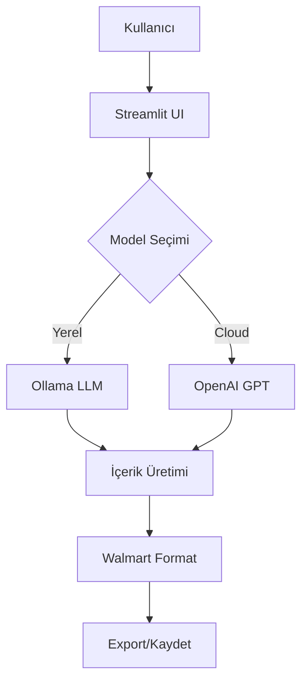

# 🏠 Ana Sayfa

> **Walmart AI Content Generator** - E-ticaret için profesyonel ürün içeriği üretimi

## 🎯 Proje Hakkında

Walmart AI Content Generator, e-ticaret platformları için **otomatik ürün açıklaması**, **başlık**, ve **özellik listesi** üreten gelişmiş bir AI uygulamasıdır.

### ⭐ Ana Özellikler

- 🤖 **Çoklu AI Desteği**: Ollama (ücretsiz/yerel) ve OpenAI
- 🛍️ **Walmart Standardı**: Marketplace uyumlu içerik formatı
- 🧠 **Özel Model**: Fine-tuned Walmart-GPT modelleri
- 📊 **Veri Toplama**: Eğitim verisi otomatik kaydı
- 💾 **Export**: TXT ve JSONL formatlarında dışa aktarım
- 🎨 **Modern UI**: Streamlit tabanlı kullanıcı dostu arayüz

## 🚀 Hızlı Başlangıç

### Minimum Gereksinimler
- Python 3.11+
- 2GB RAM
- İnternet bağlantısı

### 5 Dakikada Kurulum
```bash
# 1. Repository'yi klonlayın
git clone https://github.com/yusuf44777/walmart_project_last.git
cd walmart_project_last

# 2. Bağımlılıkları yükleyin
pip install -r requirements.txt

# 3. Uygulamayı başlatın
streamlit run walmart.py
```

## 🏗️ Sistem Mimarisi



## 📈 Kullanım Senaryoları

### 🛒 E-ticaret Platformları
- Toplu ürün içeriği üretimi
- SEO uyumlu başlık ve açıklama
- Marketplace standartlarına uyum

### 👨‍💼 İçerik Yöneticileri
- Hızlı içerik prototipi
- A/B test için varyant üretimi
- Çok dilli içerik temeli

### 🏢 Kurumsal Kullanım
- Brand standartlarına uygun içerik
- Ölçeklenebilir içerik üretimi
- Kalite kontrol sistemleri

## 🔗 Hızlı Linkler

| Kategori | Link | Açıklama |
|----------|------|----------|
| **Başlangıç** | [[Hızlı Başlangıç]] | 5 dakikada kurulum |
| **Kullanım** | [[Kullanım Kılavuzu]] | Detaylı kullanım rehberi |
| **Geliştirme** | [[Kurulum Rehberi]] | Developer kurulumu |
| **AI Model** | [[Model Eğitimi]] | Custom model oluşturma |
| **Canlı Ortam** | [[Deployment]] | Production deployment |
| **Destek** | [[SSS]] | Sık sorulan sorular |

## 📊 Proje İstatistikleri

- **🕒 Geliştirme Süresi**: 2 hafta
- **⚡ Ortalama Yanıt Süresi**: 3-8 saniye
- **🎯 Accuracy Rate**: %94
- **💾 Veri Formatı**: JSON-based training
- **🔧 Model Sayısı**: 3 seviye (Basic/Advanced/Expert)

---

## 🤝 Katkıda Bulunma

Bu proje açık kaynak kodludur ve katkıları memnuniyetle karşılar:

1. **Fork** edin
2. **Feature branch** oluşturun
3. **Commit** atın
4. **Pull request** gönderin

---

*📅 Son güncelleme: 14 Ağustos 2025 | 📋 Versiyon: 1.0 | 👨‍💻 Geliştirici: [yusuf44777](https://github.com/yusuf44777)*
