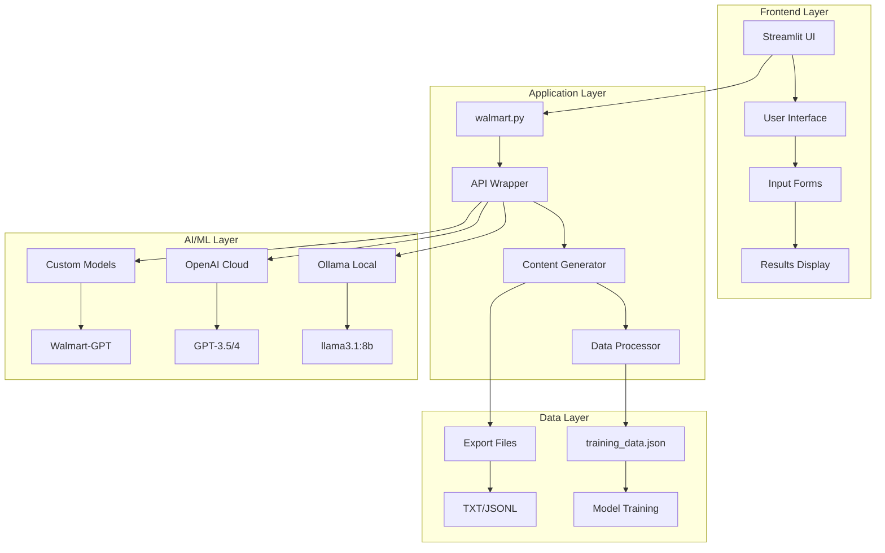
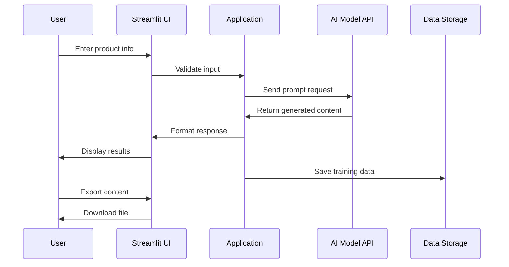

# 🏗️ Sistem Mimarisi

> **Teknik Alt Yapı** - Walmart AI Content Generator'ün mimari tasarımı

## 📐 Genel Mimari



## 🔧 Teknoloji Stack'i

### Frontend
| Teknoloji | Versiyon | Rol | Neden Seçildi |
|-----------|----------|-----|---------------|
| **Streamlit** | 1.25+ | Web UI Framework | Hızlı prototipleme, Python-native |
| **HTML/CSS** | - | Styling | Custom component styling |
| **JavaScript** | ES6 | Client-side logic | Interactive elements |

### Backend
| Teknoloji | Versiyon | Rol | Neden Seçildi |
|-----------|----------|-----|---------------|
| **Python** | 3.11+ | Core Language | AI/ML ecosystem, libraries |
| **Requests** | 2.31+ | HTTP Client | API communication |
| **Pandas** | 2.0+ | Data Processing | Data manipulation, analytics |
| **JSON** | Native | Data Format | Lightweight, human-readable |

### AI/ML
| Platform | Model | Kullanım | Avantajları |
|----------|-------|----------|-------------|
| **Ollama** | llama3.1:8b | Local LLM | Ücretsiz, privacy, offline |
| **OpenAI** | GPT-3.5/4 | Cloud LLM | High quality, reliable |
| **Custom** | Walmart-GPT | Fine-tuned | Domain-specific, optimized |

## 🌊 Data Flow Diagramı



## 📦 Modül Yapısı

### Ana Uygulama (walmart.py)
```python
├── Environment Detection
│   ├── get_ollama_base_url()
│   ├── is_local_environment()
│   └── cloud_environment_check()
│
├── AI Model Integration
│   ├── ollama_integration()
│   ├── openai_integration()
│   └── model_selection_logic()
│
├── Content Generation
│   ├── generate_content()
│   ├── format_walmart_output()
│   └── quality_validation()
│
├── Data Management
│   ├── save_training_data()
│   ├── export_functions()
│   └── data_analytics()
│
└── UI Components
    ├── sidebar_controls()
    ├── main_interface()
    └── results_display()
```

### Yardımcı Modüller
```python
├── advanced_model_training.py
│   ├── data_quality_analysis()
│   ├── model_performance_metrics()
│   └── training_pipeline()
│
├── create_walmart_model.py
│   ├── modelfile_generation()
│   ├── fine_tuning_process()
│   └── model_validation()
│
├── model_analytics.py
│   ├── performance_tracking()
│   ├── usage_statistics()
│   └── analytics_dashboard()
│
└── model_optimizer.py
    ├── parameter_tuning()
    ├── performance_optimization()
    └── resource_management()
```

## 🔄 API Entegrasyon Mimarisi

### Ollama (Local) Integration
```python
class OllamaIntegration:
    def __init__(self):
        self.base_url = "http://localhost:11434"
        self.timeout = 30
        
    def health_check(self):
        """Ollama servis durumu kontrolü"""
        
    def list_models(self):
        """Mevcut modelleri listele"""
        
    def generate_content(self, prompt):
        """İçerik üretimi"""
        
    def stream_response(self, prompt):
        """Streaming yanıt"""
```

### OpenAI Integration
```python
class OpenAIIntegration:
    def __init__(self, api_key):
        self.client = openai.OpenAI(api_key=api_key)
        self.model = "gpt-3.5-turbo"
        
    def validate_api_key(self):
        """API key doğrulama"""
        
    def generate_content(self, prompt):
        """İçerik üretimi"""
        
    def estimate_cost(self, prompt):
        """Maliyet hesaplama"""
```

## 💾 Veri Mimarisi

### Training Data Schema
```json
{
  "timestamp": "2025-08-14T10:30:00Z",
  "input": {
    "product_name": "string",
    "features": ["string"],
    "category": "string",
    "user_preferences": {}
  },
  "output": {
    "title": "string",
    "features_formatted": ["string"],
    "description": "string",
    "seo_keywords": ["string"]
  },
  "metadata": {
    "model_used": "string",
    "generation_time": "float",
    "quality_score": "float",
    "user_rating": "int"
  }
}
```

### File Structure
```
├── training_data.json      # Ana eğitim verisi
├── model_performance.db    # SQLite performans DB
├── user_preferences.json   # Kullanıcı ayarları
└── export_history.json     # Export geçmişi
```

## 🚀 Deployment Mimarisi

### Local Development
```bash
├── Python Virtual Environment
├── Ollama Local Service
├── Streamlit Dev Server
└── File-based Data Storage
```

### Cloud Production
```bash
├── Streamlit Cloud/Heroku
├── Cloud-based LLM APIs
├── Database Service (PostgreSQL)
└── File Storage (AWS S3)
```

## 🔒 Güvenlik Mimarisi

### API Key Management
```python
# Environment Variables
OPENAI_API_KEY = os.getenv('OPENAI_API_KEY')
CLOUD_OLLAMA_URL = os.getenv('CLOUD_OLLAMA_URL')

# Session State (Temporary)
st.session_state.api_key = "temporary_storage"

# Encryption (Production)
from cryptography.fernet import Fernet
key = Fernet.generate_key()
```

### Rate Limiting
```python
import time
from functools import wraps

def rate_limit(calls_per_minute=60):
    def decorator(func):
        last_called = {}
        
        @wraps(func)
        def wrapper(*args, **kwargs):
            # Rate limiting logic
            pass
        return wrapper
    return decorator
```

## 📊 Monitoring & Analytics

### Performance Metrics
```python
class PerformanceMonitor:
    def __init__(self):
        self.metrics = {
            'response_time': [],
            'success_rate': 0,
            'error_count': 0,
            'user_satisfaction': []
        }
    
    def log_request(self, start_time, end_time, success):
        """İstek metriklerini logla"""
        
    def generate_report(self):
        """Performans raporu oluştur"""
```

### Usage Analytics
```python
class UsageAnalytics:
    def track_feature_usage(self, feature_name):
        """Özellik kullanım takibi"""
        
    def user_behavior_analysis(self):
        """Kullanıcı davranış analizi"""
        
    def generate_insights(self):
        """İstatistiksel insights"""
```

## 🔧 Konfigürasyon Yönetimi

### Environment-based Config
```python
import os
from dataclasses import dataclass

@dataclass
class Config:
    # Environment detection
    environment: str = os.getenv('ENVIRONMENT', 'development')
    
    # API Settings
    ollama_base_url: str = os.getenv('OLLAMA_BASE_URL', 'http://localhost:11434')
    openai_api_key: str = os.getenv('OPENAI_API_KEY', '')
    
    # Application Settings
    max_response_time: int = int(os.getenv('MAX_RESPONSE_TIME', '30'))
    enable_data_collection: bool = os.getenv('ENABLE_DATA_COLLECTION', 'true').lower() == 'true'
    
    # Model Settings
    default_model: str = os.getenv('DEFAULT_MODEL', 'ollama')
    max_tokens: int = int(os.getenv('MAX_TOKENS', '2000'))
```

## 🔄 Sürüm Yönetimi

### Model Versioning
```python
class ModelVersionManager:
    def __init__(self):
        self.versions = {
            'walmart-gpt-basic': '1.0.0',
            'walmart-gpt-advanced': '1.1.0',
            'walmart-gpt-expert': '1.2.0'
        }
    
    def get_latest_version(self, model_name):
        """En son model versiyonunu getir"""
        
    def version_compatibility_check(self, model, version):
        """Versiyon uyumluluk kontrolü"""
```

## 📈 Ölçeklenebilirlik

### Horizontal Scaling
- **Load Balancer**: Multiple Streamlit instances
- **Database Sharding**: User-based data partitioning
- **Caching Layer**: Redis for frequent requests
- **CDN**: Static assets delivery

### Vertical Scaling
- **Memory Optimization**: Efficient data structures
- **CPU Utilization**: Parallel processing
- **GPU Support**: AI model acceleration
- **SSD Storage**: Fast I/O operations

---

*🏗️ Mimari versiyon: 2.0 | 📅 Son güncelleme: 14 Ağustos 2025 | 👨‍💻 Architect: System Design Team*
